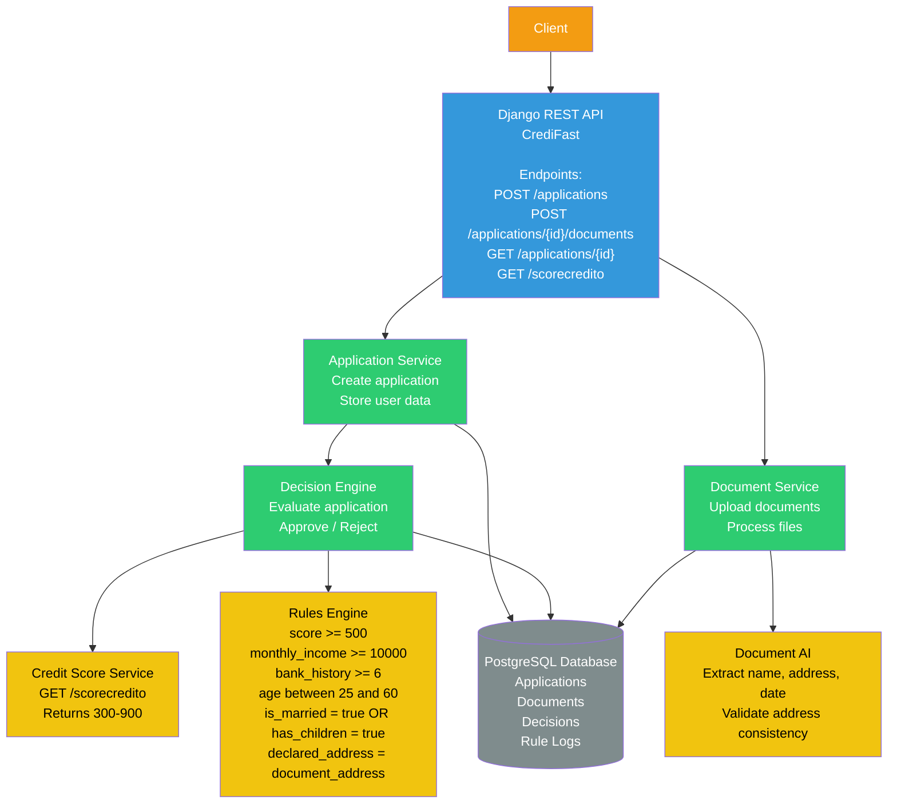

# CrediFast - Documentación de Arquitectura

Este documento describe la arquitectura, el modelo de datos y el flujo de procesamiento de la aplicación CrediFast.

---

## 1. Diagrama de Arquitectura

## 2. Diagrama ER (Modelo de Datos)
