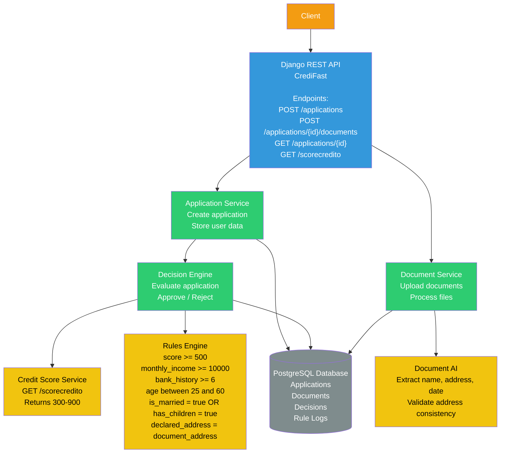
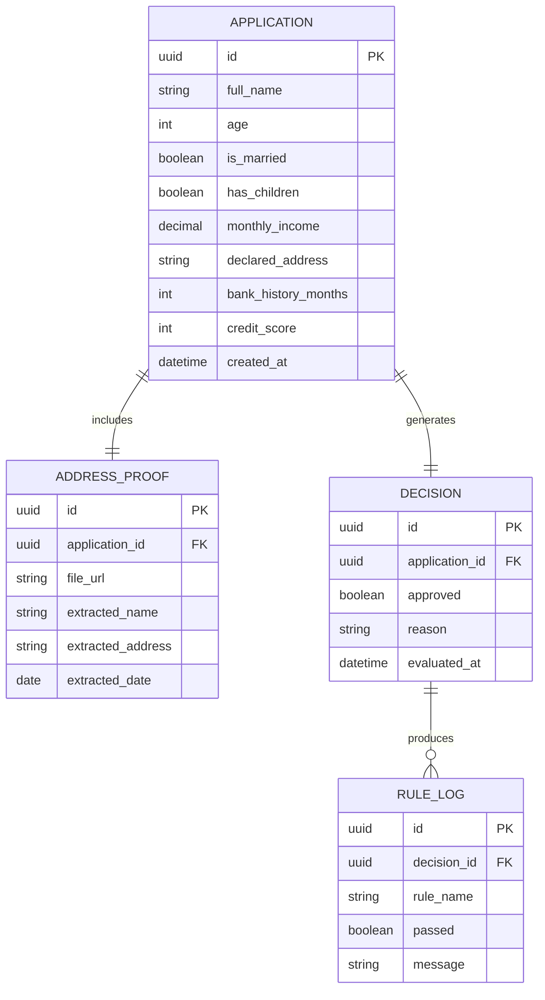
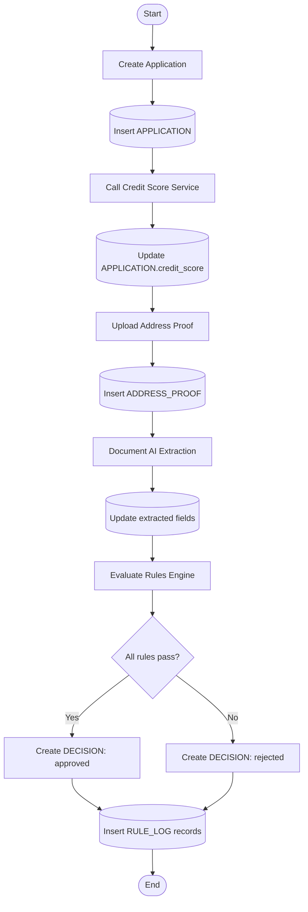

# CrediFast - Documentación de Arquitectura

Este documento describe la arquitectura, el modelo de datos y el flujo de procesamiento de la aplicación CrediFast.

---

## 1. Diagrama de Arquitectura

**Decisiones de diseño:**

- Separamos la lógica de aplicación (AppService) y la de documentos (DocService) para aislar responsabilidades.

- El Decision Engine centraliza la evaluación de reglas y decisiones de crédito.

- Los servicios de apoyo (ScoreService, RulesEngine, DocumentAI) mantienen la lógica especializada fuera del core de la API.

- La BD relacional (PostgreSQL) almacena aplicaciones, documentos, decisiones y logs de reglas para trazabilidad.

## 2. Diagrama ER (Modelo de Datos)

**Decisiones de diseño:**

- Cada APPLICATION puede tener un comprobante de domicilio y una decisión asociada.

- RULE_LOG permite auditar qué reglas se evaluaron y cuáles pasaron/fallaron.

- La normalización evita datos duplicados y asegura consistencia entre aplicaciones, documentos y decisiones.

## 3. Diagrama de Flujo (Proceso de Aplicación)

**Decisiones de diseño:**

- Se prioriza el flujo síncrono de creación de aplicación y subida de documentos.

- La integración con servicios externos (Credit Score y Document AI) ocurre después de almacenar los datos iniciales para asegurar persistencia.

- Se mantiene un registro completo de reglas evaluadas para trazabilidad y auditoría.

- La decisión final solo se genera cuando todas las reglas se evaluaron correctamente, asegurando consistencia y control de riesgos.

